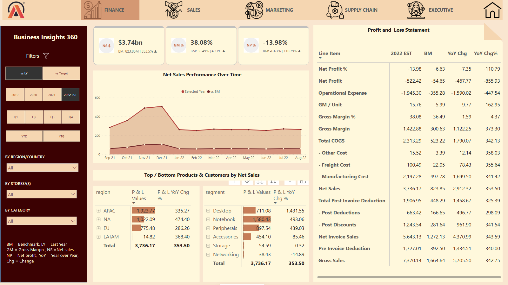
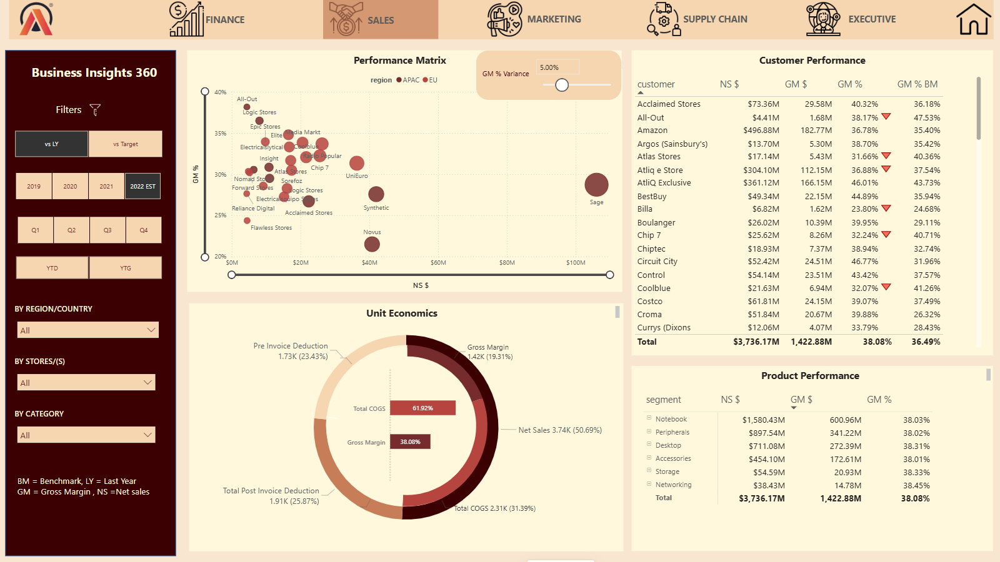
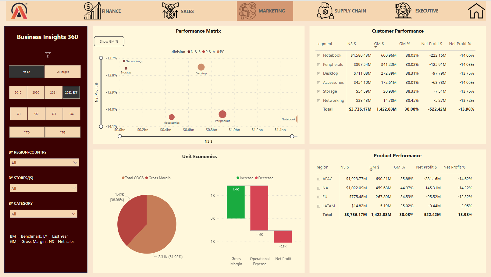
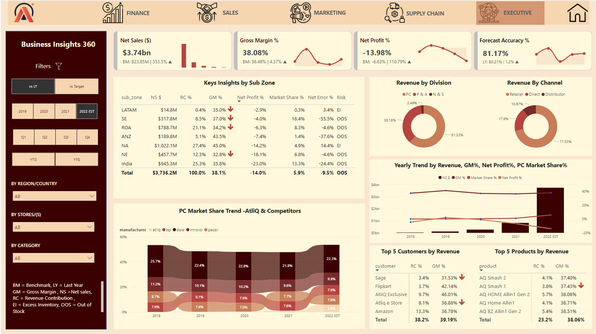

# Business-Insights-360--Power-BI

## 🚀 Transforming Data Chaos into Actionable Insights – Power BI to the Rescue! 🚀

## 📌 Overview

This project was built as part of the **Codebasics Data Analytics 4.0 Bootcamp**, where I designed and developed an end-to-end **Power BI dashboard** to solve real-world data challenges faced by **AtliQ Hardware**, a global electronics company.

With outdated Excel reports hampering strategic decision-making and forecast accuracy, AtliQ needed a better way to consume and act on business data. This dashboard empowers cross-functional teams by delivering **real-time, automated insights**.

---

## 🏢 About AtliQ Hardware

AtliQ Hardware specializes in selling computers and accessories globally. In an effort to expand into Latin American markets, they relied on intuition and surveys—which unfortunately led to **financial losses and missed targets**.

To correct course, AtliQ aimed to **embrace analytics** for informed, data-backed decisions.

---

## 🎯 Project Objectives

- Replace outdated Excel reports with an automated reporting system
- Enable real-time, department-specific views
- Visualize key performance indicators for Finance, Sales, Marketing, Supply Chain, and Executives
- Improve **forecast accuracy**, **sales performance**, and **strategic agility**

---

## 🧩 Functional Dashboard Views

### 💰 [Finance View](https://github.com/anusreemv/Business-Insights-360--Power-BI/blob/main/Finance_View.pdf)

- P&L trends: Gross Sales, Net Sales, COGS, and Net Profit
- Visual profit analysis to support financial planning
  
  

### 📈 [Sales View](https://github.com/anusreemv/Business-Insights-360--Power-BI/blob/main/Sales_View.pdf)
- Customer and product-level analysis
- Unit economics: Net Sales vs Gross Margin
- Growth matrix for performance benchmarking

  

### 📢 [Marketing View](https://github.com/anusreemv/Business-Insights-360--Power-BI/blob/main/Marketing_View.pdf)
- Product and regional performance tracking
- Insights to support campaign targeting and optimization

  

### 🚚 [Supply Chain View](https://github.com/anusreemv/Business-Insights-360--Power-BI/blob/main/Supply_Chain_View.pdf)
- Forecast Accuracy, Net Error, and Risk Categorization
- Drill-down by product, segment, and customer

  

### 📉 [Executive View](https://github.com/anusreemv/Business-Insights-360--Power-BI/blob/main/Executive_View.pdf)
- High-level KPIs across divisions
- AtliQ Market Share and Top N Products/Customers

  
---

## 🧠 [View Data Model](https://github.com/anusreemv/Business-Insights-360--Power-BI/blob/main/Data_Model.pdf)

- Star Schema with key dimension and fact tables
- Relationships optimized for performance and clarity
- Includes date table created using M language

---

## 🛠 Tech Stack

- **Power BI Desktop & Service** – Report building, publishing, and auto-refresh setup
- **SQL** – Data extraction and relational modeling
- **Excel** – Integration for master and transactional data
- **DAX** – Complex measure calculations (e.g., `SUMX`, `FILTER`, `DIVIDE`, `SWITCH`, `ALL`, `SELECTEDVALUE`)
- **Power Query (M Language)** – ETL processes for data transformation
- **DAX Studio** – Query performance testing and tuning

---

## ⚙️ Key Features & Techniques

- 📅 **Custom Date Table** using M
- 🔄 **Automated Refresh** using Personal Gateway
- 🎯 **Dynamic Titles** based on filters
- 🔍 **KPI Cards** for quick glance metrics
- 🧠 **Bookmarks** and **Tooltips** to enhance UX
- 🌐 **Data Modeling** with Star and Snowflake schemas
- ⚡ **Performance Optimization** via query tuning and DAX efficiency

---

## 📖 Business Concepts Applied

- P&L Structure: Gross Sales, Invoice Deductions, Net Sales, COGS, Gross Margin
- Fiscal Year Calendars: **YTD (Year to Date)** and **YTG (Year to Go)**
- Forecast Accuracy, Target Gaps, Risk Tiers
- Market Share Evaluation and Category Analysis

---

## 🔗 Live Report

👉 [Explore the Live Power BI Dashboard](https://app.powerbi.com/view?r=eyJrIjoiMmE2YjMwYmYtNGNmNi00YWZhLTk0OWItOTBhNDllMTc1MzdiIiwidCI6ImM2ZTU0OWIzLTVmNDUtNDAzMi1hYWU5LWQ0MjQ0ZGM1YjJjNCJ9&pageName=84d535d79a7a08dca7a5)

---

## 🤝 Connect with Me

📫 **Email:** anusreemv.6@gmail.com

🔗 **LinkedIn:** [LinkedIn](https://www.linkedin.com/in/anusreemv)

I'm always open to feedback, collaboration, and new opportunities!

